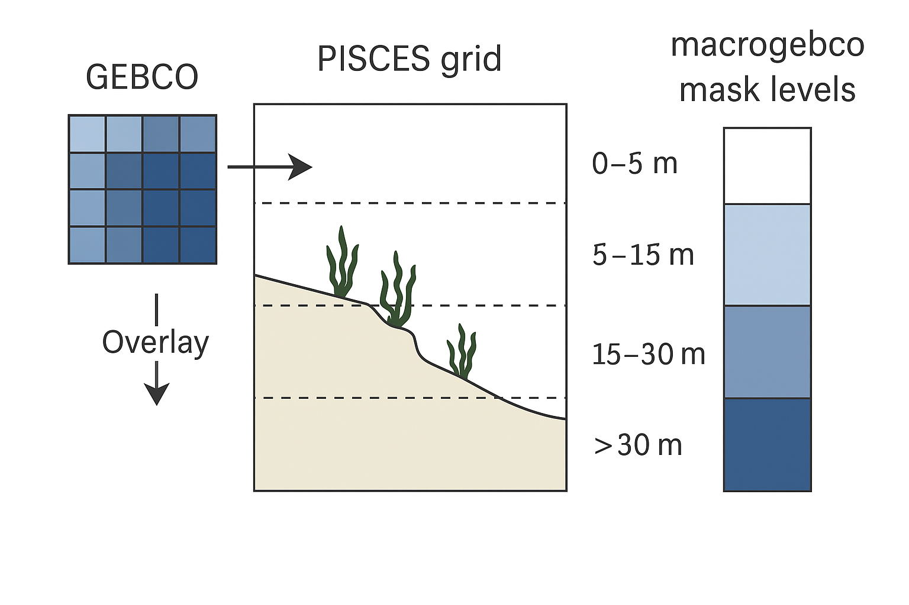

## Macroalgae Biomass Initialization

At the start of a simulation (when `ln_rsttr = .FALSE.`), the biomass of red and brown macroalgae is initialized using a bathymetric mask called `macrogebco`. This mask defines the potential habitat for macroalgae based on the high-resolution GEBCO bathymetry dataset.

At the first time step, red and brown macroalgae are seeded with a small biomass (1.0 × 10⁻³) multiplied by the proportion of the seafloor in each depth layer, as represented by the `macrogebco` mask. The `macrogebco` array gives, for each PISCES grid cell and depth level (down to 75 m), the fraction of the seafloor area derived from GEBCO data.

This mask was constructed by overlaying GEBCO bathymetry onto the PISCES grid: for each horizontal grid cell and depth interval, the number of GEBCO points falling within that volume was counted and converted into a proportion of the total horizontal cell area. This method ensures that the initial macroalgal biomass reflects the distribution of suitable shallow seafloor habitat within the model domain.

