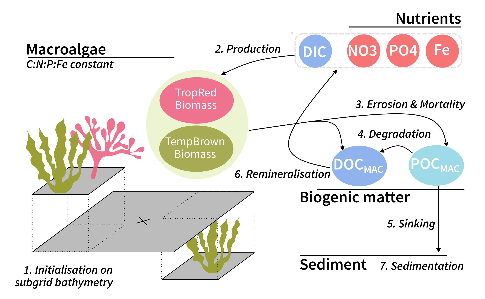

# General description of the Macroalgae module

1. [Initialisation](./Initialisation.md)
2. [Production of macroalgae](./Production.md)
3. [Mortality & Errosion](./Mortality.md)
4. [Degradation of macroalgal detritus](./Degradation.md)
5. [Sinking of detritus](./Sinking.md)
6. [Remineralisation of macroalgal DOC](./Remineralisation.md)
7. [Sedimentation of detritus](./Sedimentation.md)

.
